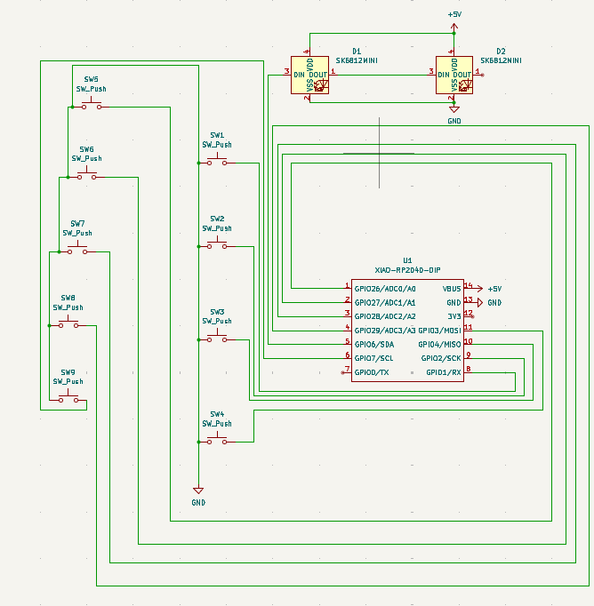
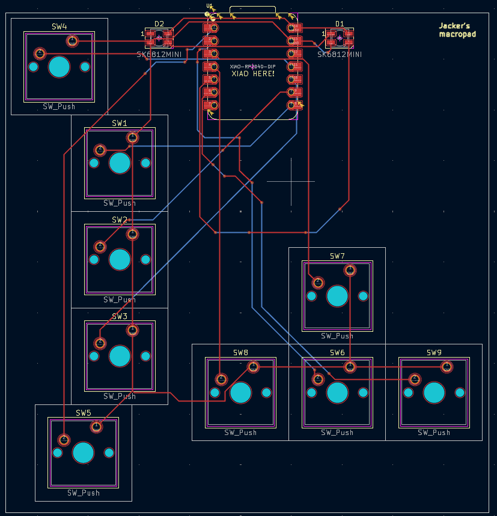
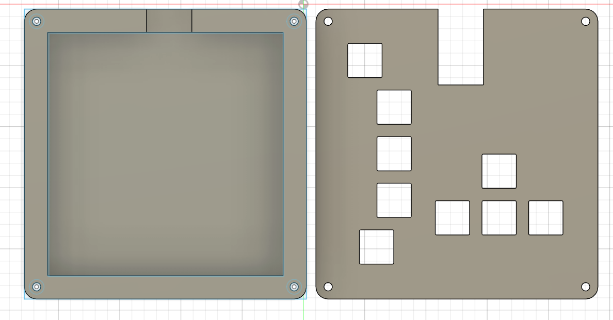

# Jacky's macropad/custom keyboard for Tetris

Here's my submission for my macropad!

## PCB and Schematic
Here's a picture of my schematic!

Schematic            |  PCB
:-------------------------:|:-------------------------:
  |  

[ x ] I ran DRC in KiCad and have made sure there are 0 errors!

## CAD Model:

This was made in fusion 360

## BOM
* 9x Cherry MX Switches
* 2x SK6812 MINI Leds
* 1x XIAO RP2040
* 4x Blank DSA Keycaps
* 4x M3x16 Bolt
* 4x M3 Heatset
* KMK Firmware
